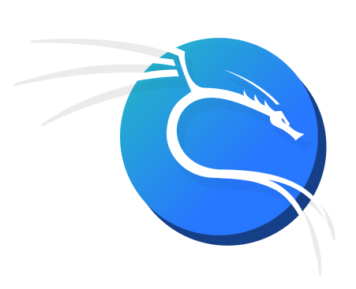
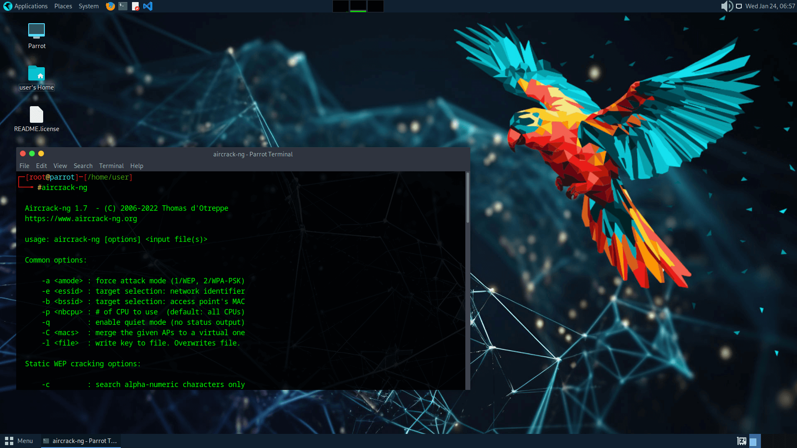
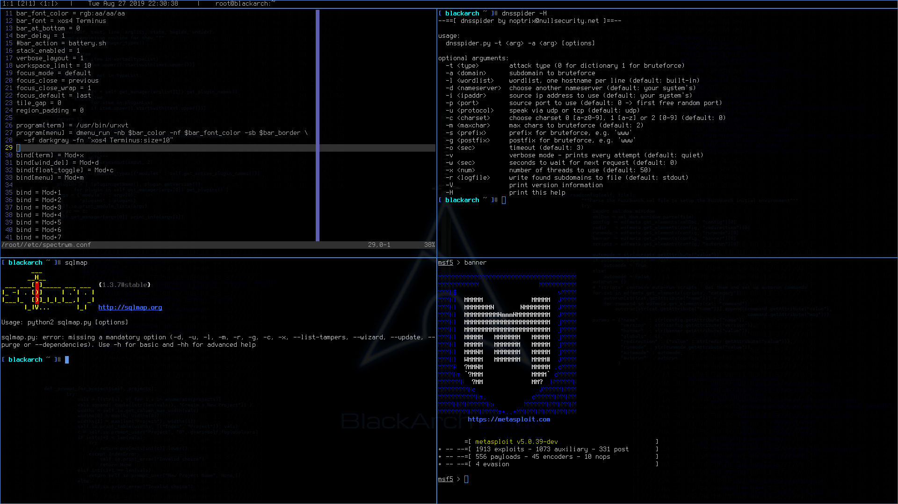

# Las mejores distribuciones para el hacking ético

En el panorama en constante evolución de la ciberseguridad, el hacking ético desempeña un papel fundamental en la identificación de vulnerabilidades y el refuerzo de los marcos de seguridad de las organizaciones. Los hackers éticos utilizan una variedad de herramientas y marcos para realizar pruebas de penetración, explotar vulnerabilidades y proteger las redes. La elección de una distribución Linux adaptada al hacking ético influye significativamente en la eficacia de estas actividades. Aquí, exploraremos algunas de las principales distribuciones de Linux utilizadas para el hacking ético, incluyendo Kali Linux, Parrot OS, y BlackArch.

## 1. Kali Linux: El Estándar de Oro

[Kali Linux](https://www.kali.org/) es posiblemente la distribución más conocida para el hacking ético y las pruebas de penetración. Desarrollado por Offensive Security, está construido sobre Debian y viene pre-empaquetado con numerosas herramientas que atienden a diferentes aspectos de las pruebas de seguridad.

### Características:
- **Herramientas preinstaladas**: Kali Linux ofrece más de `600 herramientas`, incluyendo las más populares como Metasploit, Nmap, Wireshark, y Burp Suite. Estas herramientas son esenciales para el análisis de redes, identificación de vulnerabilidades y explotación.
- **Comunidad de usuarios**: Con una comunidad de usuarios grande y de apoyo, encontrar tutoriales, foros y documentación es sencillo. Este vasto recurso hace que sea más fácil para los principiantes aprender y dominar las herramientas de hacking ético.
- **Personalización**: Kali Linux permite a los usuarios crear un Live USB personalizado, permitiendo la portabilidad y la opción de ejecutarlo en varios dispositivos sin necesidad de instalación.

### Casos de uso:
Kali es ideal tanto para principiantes como para hackers éticos avanzados debido a su `interfaz intuitiva` y su `extensa documentación`. Se utiliza con frecuencia en escenarios reales de pruebas de penetración, auditoría de seguridad y análisis forense.

## 2. Parrot OS: Una alternativa versátil

Parrot OS es otra notable distribución de Linux orientada a la seguridad y la privacidad. También está basada en Debian y está dirigida no sólo a hackers éticos, sino también a desarrolladores y usuarios preocupados por su privacidad.

### Características:
- **Ligero**: Parrot OS está diseñado para ser eficiente en el uso de recursos, por lo que es una gran opción para `hardware antiguo` o sistemas con capacidades limitadas.
- **Variedad de Herramientas**: Similar a Kali, incluye un amplio espectro de herramientas preinstaladas, que cubren pruebas de seguridad de red, explotación, análisis forense y criptografía.
- **Características de privacidad**: Parrot OS hace hincapié en la privacidad con herramientas integradas para anonimizar el tráfico de Internet, como Tor y Anonsurf. Esto es particularmente útil para los hackers éticos que realizan trabajos sensibles.

### Casos de uso:
Parrot OS es adecuado para usuarios que priorizan una solución de seguridad `todo-en-uno` que también puede facilitar el desarrollo de software. Su versatilidad lo convierte en un entorno útil para el hacking ético, la programación y el análisis forense digital.

## 3. BlackArch: El patio de recreo del hacker

BlackArch Linux es una distribución menos conocida pero potente, diseñada para la investigación y las pruebas de penetración. Está basada en Arch Linux y ofrece un inmenso repositorio de herramientas de seguridad.

### Características:
- **Herramientas masivas**: BlackArch proporciona más de `2.500 herramientas diferentes`, que atienden a varias etapas de una prueba de penetración, desde el reconocimiento hasta la explotación y post-explotación.
- **Ligera y flexible**: Al ser una distro basada en Arch, es ligera y permite la personalización, dando a los usuarios experimentados un control completo sobre su entorno.
- **Desarrollo activo**: BlackArch se actualiza con frecuencia, lo que garantiza la disponibilidad de las herramientas y prácticas de seguridad más actuales.

### Casos de uso:
BlackArch es más adecuado para usuarios avanzados e investigadores de seguridad que requieren un alto grado de flexibilidad y acceso a un vasto número de herramientas de seguridad para tareas especializadas.

## 4. Otras menciones dignas de mención

Aunque Kali, Parrot y BlackArch son las tres distribuciones más destacadas para el hacking ético, hay otras opciones notables que vale la pena considerar:

1. **BackBox**: Una distribución basada en Ubuntu centrada en proporcionar un robusto conjunto de herramientas de análisis para realizar evaluaciones de seguridad.
2. **Pentoo**: Un Live CD basado en Gentoo, diseñado específicamente para pruebas de penetración y evaluación de seguridad.
3. **RE4Media**: Principalmente enfocado en forense digital, útil para hackers éticos involucrados en respuesta a incidentes.