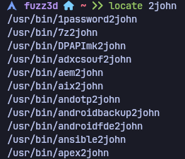
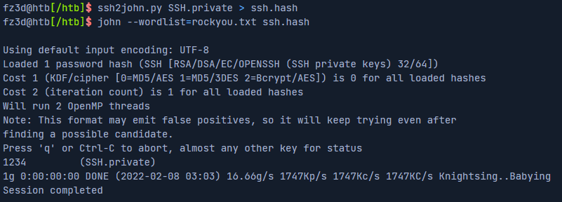

## Introducción
El cifrado de archivos es frecuentemente ignorado en contextos profesionales y personales, a pesar de regulaciones como el GDPR de la UE que exigen cifrado de datos sensibles. Atacantes pueden explotar esta vulnerabilidad, especialmente cuando se usan métodos de cifrado débiles o contraseñas predecibles.

## Tipos de Cifrado
- **Cifrado Simétrico (AES-256)**: Misma clave para cifrar/descifrar
- **Cifrado Asimétrico**: Clave pública para cifrar, privada para descifrar (usado en transferencias)

## Búsqueda de Archivos Cifrados
### Extensiones Comunes
Lista de extensiones en [FileInfo](https://fileinfo.com). Comando para buscar archivos potencialmente cifrados en Linux:
```bash
for ext in $(echo ".xls .xls* .xltx .od* .doc .doc* .pdf .pot .pot* .pp*");do 
  echo -e "\nFile extension: " $ext; 
  find / -name *$ext 2>/dev/null | grep -v "lib\|fonts\|share\|core"; 
done
```
## Claves SSH

No tienen extensión estándar. Se identifican por sus cabeceras:
```bash
grep -rnE '^\-{5}BEGIN [A-Z0-9]+ PRIVATE KEY\-{5}$' /* 2>/dev/null
```
Para verificar si una clave SSH está cifrada:
```bash
ssh-keygen -yf ~/.ssh/id_ed25519
```

### Cracking de las claves SSH cifradas

Como se mencionó en el post anterior, John The Ripper tiene muchos scripts diferentes para extraer hashes de archivos, que luego podemos proceder a crackear. Podemos encontrar estos scripts en nuestro sistema usando el siguiente comando:
```bash
locate *2john*
```


Podríamos utilizar el script de Python ssh2john.py para obtener el hash correspondiente a una clave SSH cifrada.



## Descifrar documentos protegidos por contraseña

Hoy en día, la mayoría de los informes, documentación y hojas informativas se distribuyen habitualmente como documentos de Microsoft Office o PDF. John the Ripper (JtR) incluye un script Python llamado office2john.py, que puede utilizarse para extraer hashes de contraseñas de todos los formatos comunes de documentos Office.


## Descifrar ficheros

Existen muchos tipos de archivos comprimidos. Algunas de las extensiones más comunes son tar, gz, rar, zip, vmdb/vmx, cpt, truecrypt, bitlocker, kdbx, deb, 7z y gzip.

Dada la amplia variedad de formatos de archivo y herramientas de cifrado, esta sección se centrará únicamente en una selección de métodos para descifrar tipos de archivo específicos.

### Cracking ZIP files

El formato ZIP suele utilizarse mucho en entornos Windows para comprimir muchos archivos en uno solo. El proceso de descifrado de un archivo ZIP cifrado es similar al que ya hemos visto, salvo por el uso de un script diferente para extraer los hashes.


Una vez extraído el hash, podemos utilizar JtR para crackearlo con la lista de contraseñas deseada.

```bash
john --wordlist=rockyou.txt zip.hash
```

### Descifrar archivos GZIP cifrados con OpenSSL

Como se ha comentado anteriormente, openssl puede utilizarse para cifrar archivos en formato GZIP. Para determinar el formato real de un archivo, podemos utilizar el comando file, que proporciona información detallada sobre su contenido. Por ejemplo:


Al intentar descifrarlos, es común encontrar falsos positivos o fallos. Una solución más eficaz es emplear un bucle for con openssl para probar contraseñas directamente, ignorando los errores de GZIP hasta hallar la clave correcta.
```bash
for i in $(cat rockyou.txt); do openssl enc -aes-256-cbc -d -in GZIP.gzip -k $i 2>/dev/null | tar xz; done
```

Tras ejecutarlo, se debe verificar si se extrajo algún archivo en el directorio.

**Nota:** Los mensajes de error de GZIP son normales y pueden omitirse.

## Descifrado de unidades cifradas con BitLocker

BitLocker es un sistema de cifrado de disco completo desarrollado por Microsoft (disponible desde Windows Vista). Utiliza AES con claves de 128 o 256 bits. Si se olvida la contraseña, aún puede recuperarse el acceso mediante una clave de recuperación de 48 dígitos generada durante la configuración.

### Extracción del hash

Se usa bitlocker2john para obtener cuatro tipos de hashes:
- Dos corresponden a la contraseña de BitLocker ($bitlocker$0$...).
- Dos corresponden a la clave de recuperación (más larga y difícil de adivinar).
- El enfoque práctico es atacar el hash de la contraseña.

### Ataque con Hashcat

- Modo de Hashcat: -m 22100 (para $bitlocker$0$...).

Ejemplo de comando: 
```bash
hashcat -a 0 -m 22100 '$bitlocker$0$16$02b329...' /usr/share/wordlists/rockyou.txt
```

### Montaje de unidades cifradas

**Windows**: El método más sencillo para montar una unidad virtual cifrada con BitLocker en Windows es hacer doble clic en el archivo .vhd. Como está cifrado, Windows mostrará inicialmente un error. Una vez montado, basta con hacer doble clic en el volumen BitLocker para que se le solicite la contraseña.


**Linux o MacOS**: Para ello, podemos utilizar una herramienta llamada dislocker. En primer lugar, tenemos que instalar el paquete usando apt:
```bash
sudo apt-get install dislocker
```

A continuación, creamos dos carpetas que utilizaremos para montar el VHD.
```bash
sudo mkdir -p /media/bitlocker
sudo mkdir -p /media/bitlockermount
```

A continuación, utilizamos losetup para configurar el VHD como dispositivo de bucle, descifrar la unidad mediante dislocker y, por último, montar el volumen descifrado:

```bash
sudo losetup -f -P Backup.vhd
sudo dislocker /dev/loop0p2 -u1234qwer -- /media/bitlocker
sudo mount -o loop /media/bitlocker/dislocker-file /media/bitlockermount
```

Si todo se ha hecho correctamente, ya podemos navegar por los archivos. 